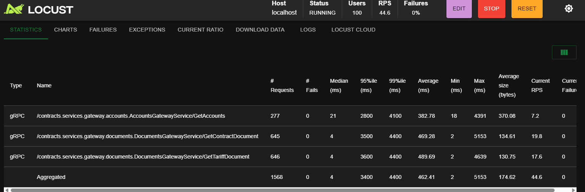
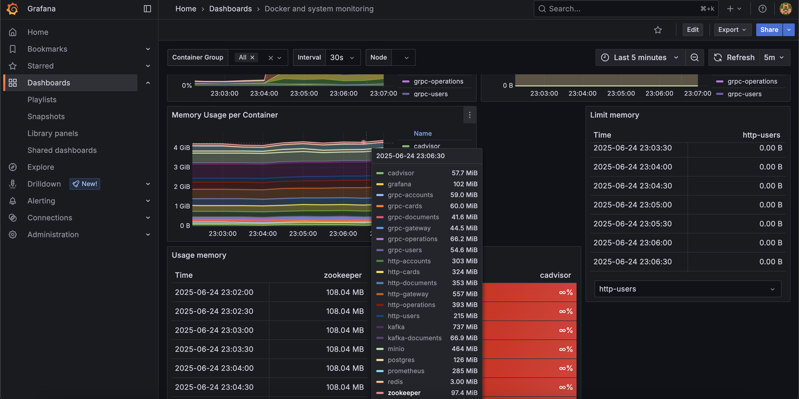

**English** | [Русский](README.md)

# Performance Tests

[](https://www.python.org/)  
[](https://locust.io/)

This project is a **performance testing framework** for APIs supporting both **HTTP** and **gRPC** protocols.

The tests are designed to evaluate the performance of a banking test environment deployed locally:  
[Test Environment](https://github.com/DmitriyFrolov2/performance-testing-environment)



## Technologies Used

🐍 **Python** • 🐞 **Locust** • 📦 **Pydantic** • ⚡ **gRPC / grpcio** • 🌐 **HTTP / HTTPX** • 🐳 **Docker** • 🐘 **PostgreSQL
** • 🗄️ **Redis** • ☁️ **MinIO** • 📊 **Grafana + Prometheus** • 📈 **Load Testing Hub** • 🧩 **Kafka** • 🛠️ **Apache
ZooKeeper**

---

## Table of Contents

- [Project Overview](#project-overview)
- [Getting Started](#getting-started)
- [Running Performance Tests](#running-performance-tests)
- [Generating Reports for Load Testing Hub](#generating-reports-for-load-testing-hub)
- [Monitoring](#monitoring)
- [CI/CD](#cicd)

---

## Project Overview

The framework supports API testing over both **HTTP** and **gRPC** using a unified approach to scenario definition.  
Tests are written in **Python** using **Locust** and follow core software development principles.

**Supported Business Scenarios**:

- **Existing User**: make a purchase, fetch documents, issue a virtual card, view transactions.
- **New User**: registration, fund a card, issue a physical card, retrieve account and document lists.

**Principles and Best Practices**:

- **SOLID** architecture — easy to maintain and extend.
- **DRY** — shared logic in base classes; minimal duplication between HTTP and gRPC.
- **KISS** — code remains readable even for complex flows.
- API clients are independent of Locust and reusable in other tests.
- Flexible seeding system configurable via scenario plans.
- Easy to add new scenarios, protocols, or load types.

**Main Components**:

- [**Scenarios**](./scenarios) — sequences of API calls simulating load.
- [**API Clients**](./clients) — abstraction layer for HTTP and gRPC APIs.
- [**Seeding**](./seeds) — automatic test data generation and management.
- [**Contracts**](./contracts) — API/data model definitions for strict typing and validation.
- [**Tools**](./tools) — fake data generators, shared Locust user logic, utilities.

---

**Test Environment Architecture**:


---

## Getting Started

### 1. Clone the repository

```bash
git clone https://github.com/your-username/performance-tests.git
cd performance-tests
```

### 2. Create a virtual environment

Linux / MacOS

```bash
python3 -m venv venv
source venv/bin/activate
```

Windows (PowerShell)

```bash
python -m venv venv
venv\Scripts\activate
```

3. Install dependencies

```bash
pip install -r requirements.txt
```

## Running Performance Tests

### Web Interface

```bash
locust -f ./scenarios/grpc/gateway/existing_user_get_documents/scenario.py
```

Web UI: http://localhost:8089

Seeding runs automatically. Set number of users, spawn rate, and start load manually.

### Headless Run via Configuration File

All parameters are pre-configured in v1.0.conf:

```ini
locustfile = ./scenarios/grpc/gateway/get_documents/scenario.py
spawn-rate = 10
run-time = 3m
headless = true
users = 100
html = ./scenarios/grpc/gateway/get_documents/report.html
```

Run:

```bash
locust --config=./scenarios/grpc/gateway/get_documents/v1.0.conf
```

Generates an HTML report; suitable for automated local runs or CI/CD.

## Generating Reports for Load Testing Hub

Important: ensure service and scenario IDs exist in the Load Testing Hub API before uploading.
[Load Testing Hub](https://github.com/Nikita-Filonov/load-testing-hub-api)

Start Container

```bash
docker compose -f docker-compose.load-testing-hub.yaml up -d
```

Run performance test:

```bash
locust --config=./scenarios/grpc/gateway/new_user_get_documents/v1.0.conf
```

Generate JSON task ratio report:

```bash
locust --config=./scenarios/grpc/gateway/new_user_get_documents/v1.0.conf --show-task-ratio-json > locust_grpc_gateway_new_user_get_documents_ratio.json
```

Upload reports:

```bash
load-testing-hub upload-locust-report --yaml-config=./scenarios/grpc/gateway/new_user_get_documents/load_testing_hub.yaml
```

Examples:
<p float="left">
  
  
</p>

## Monitoring

System metrics can be monitored via:
Grafana: http://localhost:3002
Prometheus: http://localhost9090

Pre-configured dashboards:в [Test Environment Repo](https://github.com/DmitriyFrolov2/performance-testing-environment).


## CI/CD

GitHub Actions allows headless scenario runs and automatic report publishing.

- **Reports:** [Просмотреть на GitHub Pages](https://dmitriyfrolov2.github.io/performance-tests/20505250766/)
- **Workflow config:** [performance-tests.yml](./.github/workflows/performance-tests.yml)