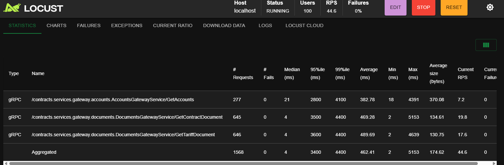
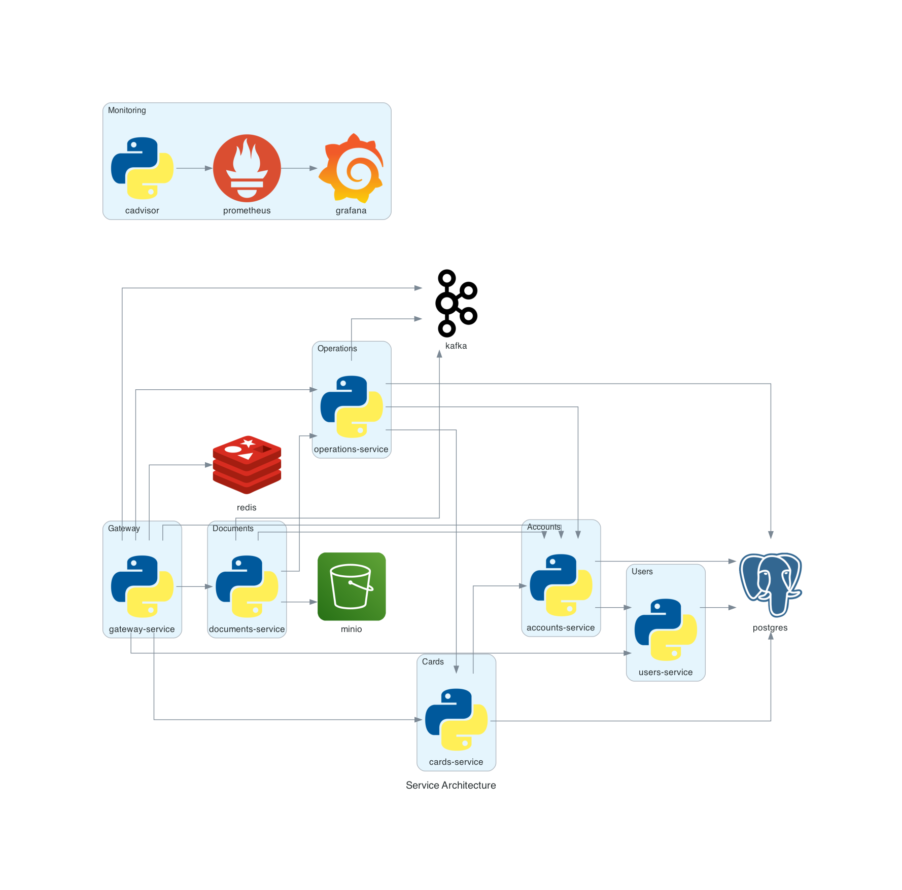
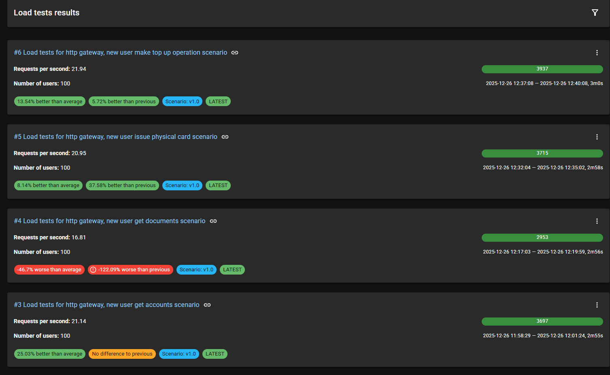
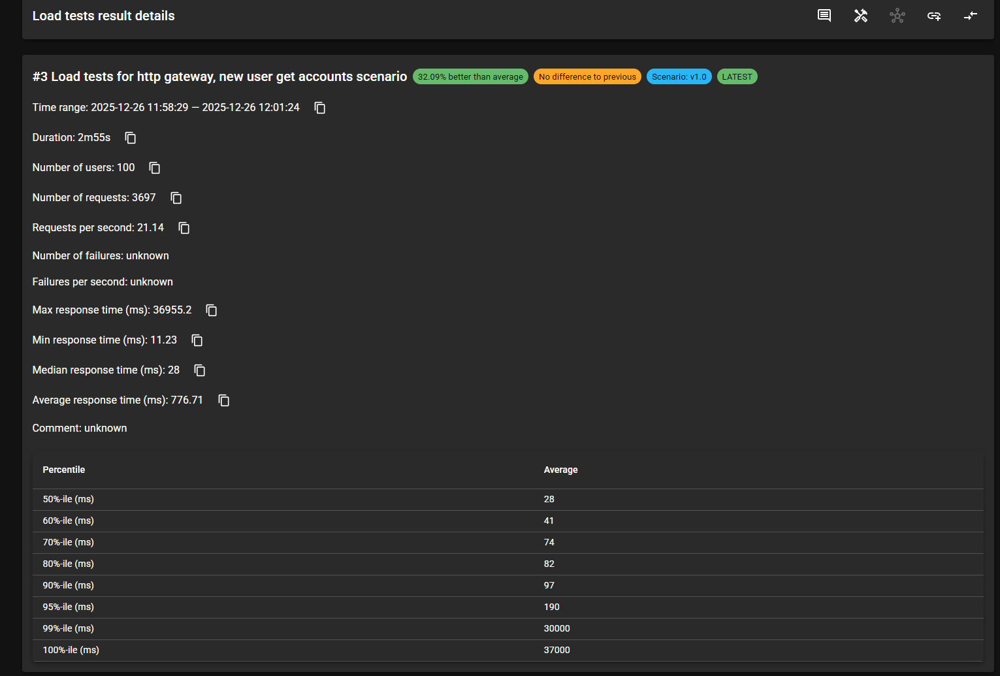
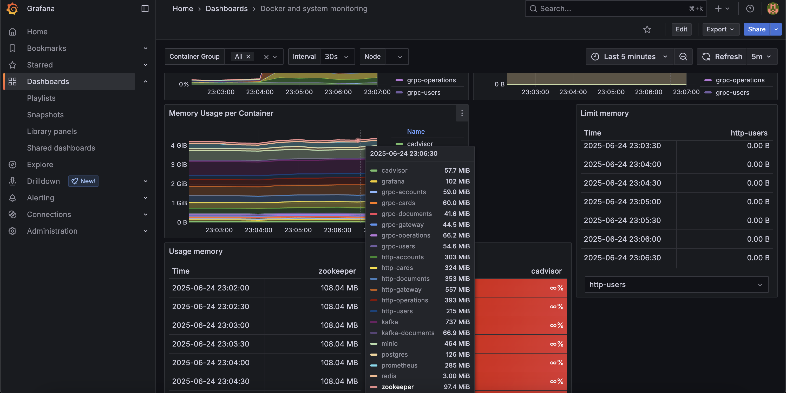

**Русский** | [English](README.en.md)

# Performance Tests

[](https://www.python.org/)
[](https://locust.io/)

Проект представляет собой фреймворк для **нагрузочного тестирования API**
с поддержкой протоколов **HTTP** и **gRPC**.

Тесты проверяют производительность банковского тестового стенда, который можно развернуть локально.<br>
Конфигурация окружения доступна в репозитории:
[Performance Testing Environment](https://github.com/DmitriyFrolov2/performance-testing-environment)



## Используемые технологии

🐍 **Python** • 🐞 **Locust** • 📦 **Pydantic** • ⚡ **gRPC / grpcio** • 🌐 **HTTP / HTTPX** • 🐳 **Docker** • 🐘 PostgreSQL
 • 🗄️ **Redis** • ☁️ **MinIO** • 📊 **Grafana + Prometheus** • 📈 **Load Testing Hub** • 🧩 **Kafka** • 🛠️ **Apache
ZooKeeper**

---

## Содержание

- [Обзор проекта](#обзор-проекта)
- [Начало работы](#начало-работы)
- [Запуск тестов производительности](#запуск-тестов-производительности)
- [Генерация отчётов для Load Testing Hub](#генерация-отчётов-для-load-testing-hub)
- [Мониторинг](#мониторинг)
- [CI/CD](#cicd)

---

## Обзор проекта

Фреймворк поддерживает тестирование API как по **HTTP**, так и по **gRPC**, используя единый подход к описанию
сценариев.  
Тесты написаны на **Python** с использованием **Locust** и построены с соблюдением основных принципов разработки.

**Поддерживаемые бизнес-сценарии**:

- **Существующий пользователь**: совершение покупки, получение документов, выпуск виртуальной карты, просмотр операций.
- **Новый пользователь**: регистрация, пополнение карты, выпуск физической карты, получение списка аккаунтов и
  документов.

**Принципы и лучшие практики**:

- Архитектура клиентов следует принципам **SOLID** - легко поддерживать и расширять.
- Соблюдение **DRY** - общие части вынесены в базовые классы, дублирование между HTTP и gRPC сведено к минимуму.
- **KISS** в сценариях - код остаётся читаемым и понятным даже при сложных бизнес-потоках.
- Клиенты API полностью независимы от Locust, что позволяет использовать их в других тестах.
- Гибкая система seeding с возможностью настройки через план сценария.
- Легко добавлять новые сценарии, протоколы или типы нагрузки по мере развития системы.

**Основные компоненты**:

- [**Сценарии**](./scenarios) - логически связанные последовательности API-запросов, используемые для моделирования
  нагрузки на систему.
- [**API-клиенты**](./clients) - слой абстракции для работы с HTTP и gRPC API, не зависящий от механики нагрузочного
  инструмента.
- [**Seeding**](./seeds) - автоматическая генерация и управление тестовыми данными через план сценария.
- [**Контракты**](./contracts) - описание API и моделей данных для строгой типизации и валидации.
- [**Инструменты**](./tools) - генераторы фейковых данных, общая логика пользователей Locust и вспомогательные утилиты.

---
**Архитектура стенда**:



------

## Начало работы

### 1. Клонирование репозитория

```bash
git clone https://github.com/your-username/performance-tests.git
cd performance-tests
```

### 2. Создание виртуального окружения

#### Linux / MacOS

```bash
python3 -m venv venv
source venv/bin/activate
```

#### Windows (PowerShell)

```bash
python -m venv venv
venv\Scripts\activate
```

### 3. Установка зависимостей

```bash
pip install -r requirements.txt
```

---

## Запуск тестов производительности

### Через веб-интерфейс

Для локальной отладки и интерактивного запуска:

```bash
locust -f ./scenarios/grpc/gateway/existing_user_get_documents/scenario.py
```

Веб-интерфейс будет доступен на http://localhost:8089

Сразу выполняется seeding

В интерфейсе можно указать количество пользователей, spawn-rate и запустить нагрузку вручную

### Headless запуск через конфигурационный файл

Все параметры нагрузки и отчётов уже прописаны в файле v1.0.conf:

```ini
locustfile = ./scenarios/grpc/gateway/get_documents/scenario.py
spawn-rate = 10
run-time = 3m
headless = true
users = 100
html = ./scenarios/grpc/gateway/get_documents/report.html

```

Запуск:

```bash
locust --config=./scenarios/grpc/gateway/get_documents/v1.0.conf
```

Подходит для локального автоматизированного запуска или CI/CD. Генерируется HTML-отчёт с результатами нагрузки.

## Генерация отчётов для Load Testing Hub

Load Testing Hub - инструмент для сбора, хранения, анализа, визуализации и сравнения результатов нагрузочного
тестирования.

**Важно**:
Перед первой загрузкой результатов убедитесь, что сервис и сценарий с указанными ID существуют в API Load Testing Hub.
Это обязательный шаг - без зарегистрированных сущностей загрузка не пройдёт. Подробности по регистрации можно найти в
репозитории backend: [Load Testing Hub](https://github.com/Nikita-Filonov/load-testing-hub-api)

### Запуск контейнера

Поднимите сервис Load Testing Hub через `docker-compose`:

```bash
docker compose -f docker-compose.load-testing-hub.yaml up -d
```

Перед загрузкой результатов необходимо зарегистрировать сервис.<br>
После запустите нагрузочный тест через конфигурационный файл:

```bash
locust --config=./scenarios/grpc/gateway/new_user_get_documents/v1.0.conf
```

Для аналитики распределения задач сгенерируйте JSON-отчёт:

```bash
locust --config=./scenarios/grpc/gateway/new_user_get_documents/v1.0.conf --show-task-ratio-json > locust_grpc_gateway_new_user_get_documents_ratio.json
```

Загрузка отчётов в Load Testing Hub

```bash
load-testing-hub upload-locust-report --yaml-config=./scenarios/grpc/gateway/new_user_get_documents/load_testing_hub.yaml
```

Использование Load Testing Hub позволяет визуализировать нагрузку по задачам и сравнивать результаты нескольких
прогонов.

### Примеры:

<p float="left">
  
  
</p>

## Мониторинг

Помимо встроенных отчётов Locust, метрики системы можно отслеживать через:

- **Grafana:** [http://localhost:3002](http://localhost:3002)
- **Prometheus:** [http://localhost:9090](http://localhost:9090)

Дашборды предварительно настроены
в [репозитории стенда](https://github.com/DmitriyFrolov2/performance-testing-environment).


---

## CI/CD

Интеграция с GitHub Actions позволяет запускать сценарии в headless-режиме и автоматически публиковать отчёты на GitHub
Pages.

- **Публикация отчётов:** [Просмотреть на GitHub Pages](https://dmitriyfrolov2.github.io/performance-tests/20925554294/)
- **Конфигурация workflow:** [performance-tests.yml](./.github/workflows/performance-tests.yml)

